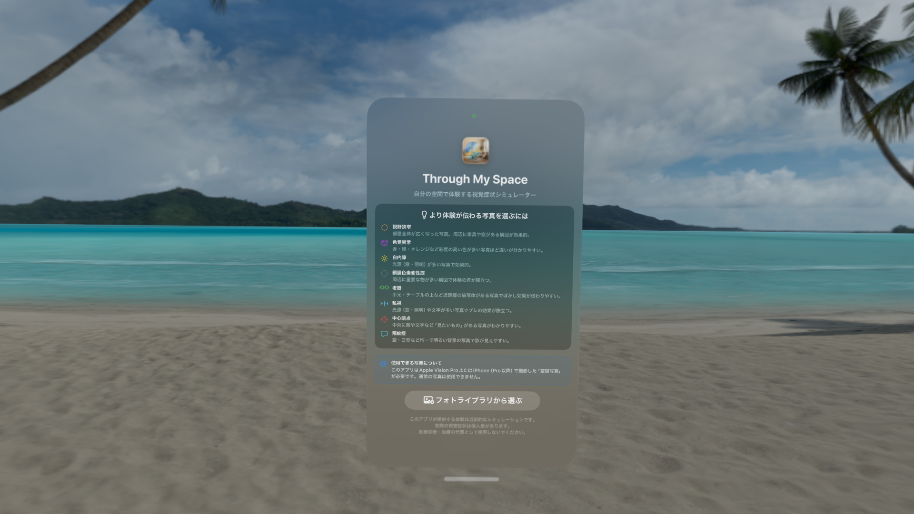
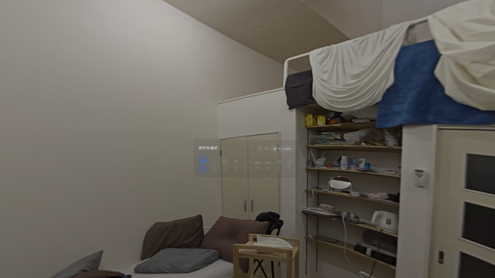
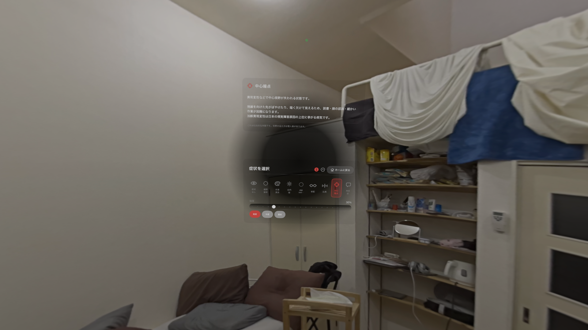

# I Built a Vision Pro App to Let You See the World Through Someone Else's Eyes

## What I Built

I just released **Through My Space** on the App Store — an Apple Vision Pro app that lets you experience visual conditions like glaucoma, cataracts, and color blindness using **your own spatial photos**.

https://apps.apple.com/jp/app/id6760091243

The idea is simple: instead of showing you stock footage of a generic room, it takes a spatial photo of *your* space — your bedroom, your office, your kitchen — and applies visual condition filters to it. When your own familiar environment transforms, the experience of visual impairment becomes much more personal.

> Disclaimer: This app provides approximate simulations only. It is not intended for medical diagnosis or treatment.



---

## Background: Why Spatial Photos?

Vision Pro has a "passthrough" feature that lets you access the real-time camera feed. However, apps that process this feed require an **Enterprise API** — meaning they can't be distributed on the App Store for general use.

Spatial photos, on the other hand, are just data. You can apply any Core Image filter you want to them and display the result as a texture in RealityKit. That's the entire technical premise of this app.

---

## What I Implemented



The app simulates 8 visual conditions:

| Condition | Implementation |
|---|---|
| Visual Field Loss (Glaucoma) | Core Image: CIVignetteEffect |
| Color Vision Deficiency (3 types) | Core Image: Brettel 1997 matrix transform |
| Cataracts | Core Image: CIGaussianBlur + Bloom effect + yellow tint |
| Retinitis Pigmentosa | Core Image: CIRadialGradient + CIBlendWithMask |
| Presbyopia | Core Image: CIGaussianBlur + contrast reduction |
| Astigmatism | Core Image: CIMotionBlur (30°) + luminance mask |
| Central Scotoma | ARKit WorldTracking + RealityKit Entity overlay |
| Floaters | ARKit WorldTracking + RealityKit Entity overlay |

**Tech stack:** SwiftUI, RealityKit, ShaderGraph, Core Image, ARKit, PhotosUI

I should mention: this was my first Swift / visionOS project. My background is React Native with Expo. I'll include some React Native comparisons throughout for anyone coming from a similar background.

---

## The Hard Parts: Everything I Got Stuck On

### 1. Getting the Full Spatial Photo Data

This one tripped me up for a while.

When you use `PHPickerConfiguration()` (the default), the picker goes through `NSItemProvider`, which converts the spatial photo into a single-frame HEIC (~536KB). You lose the stereo pair entirely — only the left eye frame comes through.

The fix: use `PHPickerConfiguration(photoLibrary: .shared())` instead. This gives you the `assetIdentifier`, which you can use with `PHAssetResourceManager` to get the complete binary data.

```swift
// ❌ This converts the spatial photo to a single flat HEIC
var config = PHPickerConfiguration()

// ✅ This gives you assetIdentifier → full HEIC binary
var config = PHPickerConfiguration(photoLibrary: .shared())
```

Then to get the actual data:

```swift
let options = PHAssetResourceRequestOptions()
options.isNetworkAccessAllowed = true

PHAssetResourceManager.default().requestData(
    for: resource,
    options: options
) { data in
    // Full HEIC binary — spatial photos are typically 2–6MB
}
```

---

### 2. Extracting Left/Right Frames from the HEIC

This is the most important technical lesson from this project.

Spatial photos taken with Vision Pro have this internal structure:

```
HEIC file
├── compatible brand: MiHB  ← Apple's spatial photo marker
├── {Groups}
│   └── "ster" group
│       ├── GroupImageIndexLeft  = 0
│       └── GroupImageIndexRight = 1
├── index 0: Left eye  2560x2560 (25 HEVC tiles)
└── index 1: Right eye 2560x2560 (25 HEVC tiles)
```

The trap: `kCGImagePropertyGroups` (which tells you which index is left eye and which is right eye) **does not exist in per-index properties**. It only exists in the source-level properties.

```swift
// ❌ kCGImagePropertyGroups is NOT here
let props = CGImageSourceCopyPropertiesAtIndex(imageSource, 0, nil)

// ✅ It's here — the source-level properties (no index argument)
guard let sourceProps = CGImageSourceCopyProperties(imageSource, nil) as? [CFString: Any],
      let groups = sourceProps[kCGImagePropertyGroups] as? [[CFString: Any]],
      let group = groups.first(where: {
          ($0[kCGImagePropertyGroupType] as? String)
              == (kCGImagePropertyGroupTypeStereoPair as String)
      }) else {
    // fallback: use index 0 as left eye
    return
}

let leftIndex  = (group[kCGImagePropertyGroupImageIndexLeft]  as? Int) ?? 0
let rightIndex = (group[kCGImagePropertyGroupImageIndexRight] as? Int) ?? 1

let leftImage  = CGImageSourceCreateImageAtIndex(imageSource, leftIndex,  nil)
let rightImage = CGImageSourceCreateImageAtIndex(imageSource, rightIndex, nil)
```

I spent significant time on this. There's almost no documentation or Stack Overflow answers about it.

---

### 3. Loading ShaderGraph Materials from the Right Bundle

When loading a ShaderGraph material, you must load it from `realityKitContentBundle`, not `.main`.

```swift
// ❌ This throws invalidTypeFound
let material = try await ShaderGraphMaterial(
    named: "/Root/StereoscopicMaterial",
    from: "Materials/StereoscopicMaterial",
    in: .main
)

// ✅ Use realityKitContentBundle
let material = try await ShaderGraphMaterial(
    named: "/Root/StereoscopicMaterial",
    from: "Materials/StereoscopicMaterial",
    in: realityKitContentBundle
)
```

---

### 4. UV V-Axis Inversion on the Dome Mesh

When I first projected the spatial photo onto the dome mesh, the image appeared upside down. The fix was to invert the V axis during UV generation:

```swift
// ❌ Upside down
uvs.append(SIMD2<Float>(ht, vt))

// ✅ Correct orientation
uvs.append(SIMD2<Float>(ht, 1.0 - vt))
```

---

### 5. Real-Time Head Tracking: Core Image Won't Work at 60fps

For central scotoma (age-related macular degeneration) and floaters, I needed the visual effect to follow the user's head movement in real time.

My first instinct was to apply Core Image filters with a dynamic center coordinate — compute the gaze direction, update the filter parameter, regenerate the texture, upload it to the GPU. Every frame.

That doesn't work. Regenerating a 2560×2560 texture every 16ms is way too slow.

**The solution: RealityKit Entity overlay**

Instead of updating the texture, I created a `ModelEntity` (a flat plane with a gradient texture for scotoma, small spheres for floaters) and simply updated its `position` every frame. Moving an entity's position is nearly free compared to texture regeneration.

```swift
// ARKit WorldTrackingProvider at 60fps
while !Task.isCancelled {
    if let anchor = worldTracking.queryDeviceAnchor(atTimestamp: CACurrentMediaTime()) {
        let matrix = anchor.originFromAnchorTransform

        // Extract the forward vector (-Z axis of the head transform)
        let rawForward = SIMD3<Float>(
            -matrix.columns.2.x,
            -matrix.columns.2.y,
            -matrix.columns.2.z
        )

        // Smooth to prevent jitter (α = 0.15 for scotoma)
        smoothedForward = smoothedForward + (rawForward - smoothedForward) * 0.15
        let len = simd_length(smoothedForward)
        if len > 0.001 { smoothedForward = smoothedForward / len }

        let headPos = SIMD3<Float>(
            matrix.columns.3.x,
            matrix.columns.3.y,
            matrix.columns.3.z
        )

        // Place the entity 1.5m in front of the head
        let pos = headPos + smoothedForward * 1.5
        scotomaEntity.position = pos
        // Billboard: always face the user
        scotomaEntity.look(at: headPos, from: pos, relativeTo: nil)
    }
    try? await Task.sleep(for: .milliseconds(16))
}
```

For floaters, I used `α = 0.04` — a much slower follow speed. This creates the sensation that the floaters have inertia, lagging behind your head movement. That "chase them but they escape" quality is characteristic of real floaters.




---

## Stereo Display: CameraIndexSwitch

To maintain the stereoscopic depth of the original spatial photo, I used ShaderGraph's `ND_realitykit_geometry_switch_cameraindex_color3` node. It automatically routes the left texture to the left eye render and the right texture to the right eye render.

```
LeftTexture  → LeftImageSampler  → CameraIndexSwitch.left
RightTexture → RightImageSampler → CameraIndexSwitch.right
                                       ↓ auto-routes per eye
                                    UnlitSurface
```

From Swift, updating the textures looks like this:

```swift
try material.setParameter(
    name: "LeftTexture",
    value: .textureResource(leftTexture)
)
try material.setParameter(
    name: "RightTexture",
    value: .textureResource(rightTexture)
)
domeEntity.model?.materials = [material]
```

---

## Core Image Filter Examples


### Visual Field Loss (Glaucoma)

```swift
let filter = CIFilter.vignetteEffect()
filter.inputImage = image
filter.center = CIVector(x: width / 2, y: height / 2)
filter.radius = shortSide * mix(1.0, 0.12, t: intensity)
filter.intensity = mix(0.0, 2.5, t: intensity)
filter.falloff = mix(0.5, 0.15, t: intensity)
```

### Cataracts (Bloom Effect)

A simple blur looks flat. Real cataracts cause halos around light sources — the "bloom" effect. Here's the pipeline:

```swift
// Step 1: Reduce saturation and contrast, increase brightness (haze)
// Step 2: CIGaussianBlur (light scattering)
// Step 3: Bloom — blend the blurred image onto the original,
//         using a luminance mask so only bright areas get the halo
// Step 4: Add a slight yellow tint (lens yellowing with age)

let luminanceMask = hazedImage.applyingFilter("CIColorControls", parameters: [
    kCIInputSaturationKey: 0.0,  // grayscale
    kCIInputContrastKey:   2.0,  // amplify bright/dark separation
    kCIInputBrightnessKey: -0.1
])

let bloomFilter = CIFilter(name: "CIBlendWithMask")!
bloomFilter.setValue(hazedImage,    forKey: kCIInputBackgroundImageKey)
bloomFilter.setValue(clampedBlur,   forKey: kCIInputImageKey)
bloomFilter.setValue(luminanceMask, forKey: kCIInputMaskImageKey)
```

### Color Vision Deficiency (Brettel 1997)

Based on a 1997 academic paper, this uses a color matrix to simulate how each type of color blindness shifts perceived colors. For deuteranopia (green-weak, type 2):

```swift
let rVec = CIVector(x:  0.367, y: 0.861, z: -0.228, w: 0)
let gVec = CIVector(x:  0.280, y: 0.673, z:  0.047, w: 0)
let bVec = CIVector(x: -0.012, y: 0.043, z:  0.969, w: 0)
```

---

## Architecture Overview

```
AppModel (@Observable)
├── sourceStereoImages: StereoCGImages?     // Raw CGImages (left + right)
├── selectedStereoTextures: StereoTextures? // Processed TextureResources
├── currentCondition: ConditionType         // Selected visual condition
├── conditionIntensity: Float               // 0.0 – 1.0
└── textureVersion: Int                     // Triggers texture update in ImmersiveView

ContentView (photo picker)
  → SpatialPhotoLoader.loadStereoImages(from: Data)
  → sourceStereoImages updated
  → Condition.applyFilter() runs Core Image pipeline
  → selectedStereoTextures updated
  → textureVersion += 1
  → ImmersiveView.onChange fires
  → Dome entity material parameters updated
```

---

## For React Native Developers

Since my background is React Native, here's a mapping that might help others coming from the same place:

| React Native / Expo | Swift / visionOS |
|---|---|
| `Context` / `useState` | `@Observable` class (`AppModel`) |
| `props` | `@Binding` / function arguments |
| Function component | `struct` conforming to `View` |
| `useEffect` | `.onAppear` / `.task` modifier |
| `navigation.navigate()` | `openImmersiveSpace()` / `dismissImmersiveSpace()` |
| Redux store | `@State` + `@Environment` |
| `StyleSheet.create` | SwiftUI modifiers (`.padding()`, `.frame()`, etc.) |

The biggest mental shift is that SwiftUI is **declarative but compiled** — there's no JavaScript bridge, and type errors show up at compile time rather than runtime.

---

## Open Source

The full source code is on GitHub:

https://github.com/kiyohken2000/ThroughMySpace

---

## Takeaways

1. **`PHPickerConfiguration(photoLibrary: .shared())` is not optional** for spatial photos. The default configuration silently strips the stereo pair.

2. **`kCGImagePropertyGroups` lives at the source level**, not the index level. `CGImageSourceCopyProperties(source, nil)` — no index argument.

3. **Core Image is too slow for real-time gaze tracking**. Use RealityKit Entity position updates instead.

4. **ShaderGraph materials must be loaded from `realityKitContentBundle`**, not `.main`.

5. **Lerp smoothing is essential** for any head/gaze tracking. Raw sensor data at 60fps produces visible jitter. `α = 0.15` works well for scotoma; `α = 0.04` gives floaters a natural inertia.

If you're building on Vision Pro and hit any of these same walls, I hope this saves you some time.
